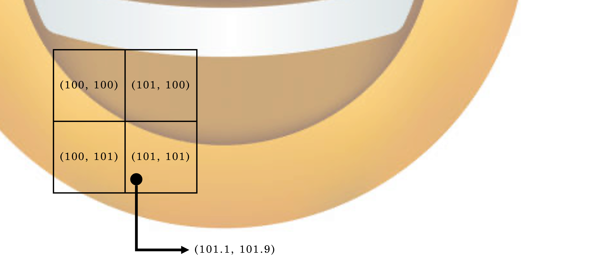

<p align="center">
    
    <br>
    
</p>

<span align="center">

# face-detect-emoji

</span>

### Team

- Lead: 양재훈
- Members: 김주형, 정채린, 윤석준

### Role

- 프로젝트 구조 및 기술 설계: 양재훈
- AI: 양재훈
- Partial Affine Transformation: 김주형
- Full Affine Transformation: 정채린
- Overlay Warp Affine: 윤석준

### Build & Run

```bash
# Build Wasm
cd wasm
./build.sh

# Run
python3 -m http.server 8000
open http://localhost:8000
```

### Overview

이 프로젝트는 카메라에서 받아온 프레임으로부터 얼굴 랜드마크를 추출하고, 이를 기반으로 얼굴 표정을 인식한 후 표정에 따라 이모지를 출력하는 프로젝트입니다.

모든 과정을 third-party 라이브러리 없이 순수한 C++ 로 구현하였으며, 같은 기능을 하는 JavaScript 버전도 구현하여 두 백엔드 간 성능을 비교할 수 있도록 하였습니다.

### 0. Architecture


### 1. Preprocessing

MediaPipe 를 사용하여 얼굴의 랜드마크를 추출하면 478개의 랜드마크를 얻을 수 있습니다.

사람의 얼굴이 정면으로 찍히지 않을 수 있으므로, Partial Affine Transformation 을 통해 얼굴의 자세를 정규화합니다.

```math
\begin{bmatrix}
s_x \cos \theta & -s_x \sin \theta & t_x \\
s_y \sin \theta  & s_y \cos \theta & t_y \\
0 & 0 & 1
\end{bmatrix}
\begin{bmatrix}
x_0 \\
y_0 \\
1
\end{bmatrix}
=
\begin{bmatrix}
u_0 \\
v_0 \\
1
\end{bmatrix}
```


### 2. AI

Pytorch 를 통해 모델을 학습시키고, BatchNorm 을 fold 한 뒤 가중치와 편향을 C++ 헤더 파일로 추출하였습니다.

> [wasm/model_weights.h](wasm/model_weights.h)

preprocessing 과정에서 얻은 얼굴 랜드마크를 이 모델에 입력하면 얼굴 표정을 인식할 수 있습니다.

```cpp
void forward(const float* input, float* output) {
    // Layer 1
    alignas(64) float hidden1[HIDDEN1_DIM];
    for (int i = 0; i < HIDDEN1_DIM; ++i) {
        float sum = LAYER1_BIAS[i];
        for (int j = 0; j < INPUT_DIM; ++j) {
            sum += LAYER1_WEIGHT[i][j] * input[j];
        }
        hidden1[i] = leaky_relu(sum);
    }

    // Layer 2
    alignas(64) float hidden2[HIDDEN2_DIM];
    for (int i = 0; i < HIDDEN2_DIM; ++i) {
        float sum = LAYER2_BIAS[i];
        for (int j = 0; j < HIDDEN1_DIM; ++j) {
            sum += LAYER2_WEIGHT[i][j] * hidden1[j];
        }
        hidden2[i] = leaky_relu(sum);
    }

    // Layer 3 (output)
    for (int i = 0; i < OUTPUT_DIM; ++i) {
        float sum = LAYER3_BIAS[i];
        for (int j = 0; j < HIDDEN2_DIM; ++j) {
            sum += LAYER3_WEIGHT[i][j] * hidden2[j];
        }
        output[i] = sum;
    }
}
```

> [wasm/predict.cpp](wasm/predict.cpp)

`alignas(64)` 를 사용하여 64바이트 단위로 메모리를 정렬하고, `HIDDEN1_DIM`, `HIDDEN2_DIM`, `INPUT_DIM`, `OUTPUT_DIM` 을 `constexpr` 로 정의하여 컴파일러가 최대한 최적화할 수 있도록 하였습니다.

### 3. Emoji Overlay

얼굴 표정을 인식한 후 이모지를 얼굴에 출력하기 위해, 이모지 상 좌표와 얼굴 랜드마크 간 변환 식을 Full Affine Transformation 을 통해 계산합니다.

```math
\begin{bmatrix}
a & b & c \\
d & e & f \\
0 & 0 & 1
\end{bmatrix}
\begin{bmatrix}
x_0 \\
y_0 \\
1
\end{bmatrix}
=
\begin{bmatrix}
u_0 \\
v_0 \\
1
\end{bmatrix}
```

```math
\begin{aligned}
u_0 = ax_0 + by_0 + c \\
v_0 = dx_0 + ey_0 + f \\
u_1 = ax_1 + by_1 + c \\
v_1 = dx_1 + ey_1 + f \\
u_2 = ax_2 + by_2 + c \\
v_2 = dx_2 + ey_2 + f \\
\end{aligned}
```

구해야하는 미지수가 6개이므로, 3개의 점을 이용하여 6개의 방정식을 세워 해를 구합니다.


구한 Affine Matrix $M$ 은 emoji 에서 canvas 로의 변환 행렬입니다. 곧, $M^{-1}$ 은 canvas 에서 emoji 로의 변환 행렬입니다.

canvas 의 모든 픽셀을 $M^{-1}$ 을 이용하여 emoji 의 좌표로 변환한 후, 이모지의 픽셀 값을 가져오면 이모지를 얼굴에 출력할 수 있습니다.

이 과정에서 이모지의 픽셀 좌표가 소수점 이하의 값을 가질 수 있으므로, Bilinear Interpolation 을 통해 픽셀 값을 보간합니다.



> [wasm/geometry.cpp](wasm/geometry.cpp)

### Pain Points

- 처음엔 Partial Affine Transformation 을 사용하려고 했으나, 얼굴 랜드마크가 정면으로 찍히지 않을 수 있으므로 Full Affine Transformation 을 사용하였습니다. 이 과정에서 수학적 지식이 부족하여 구현에 어려움을 겪었습니다.
- 이모지 Warp Affine 과정에서 이모지의 픽셀 좌표가 소수점 이하의 값을 가질 수 있으므로, Bilinear Interpolation 을 통해 픽셀 값을 보간해야 했습니다.
- 초기 빌드 시 최적화 옵션을 적용하지 않아 레이턴시가 높았습니다.

### Optimization

Wasm 구동 시 아래와 같은 최적화 기법을 사용하여 레이턴시를 최소화 했습니다.

1. `alignas(64)` 및 `constexpr` 를 사용하여 컴파일러가 최적화할 수 있도록 하였습니다.
2. `float*` 를 `geo::Point` 로 변환하는 과정에서 불필요한 복사를 제거하였습니다.
3. 빌드 시 `-O3`, `-flto`, `-ffast-math`, `-msimd128` 옵션을 사용하여 수학 연산을 빠르게 하였습니다.

### Benchmark

- Apple Silicon M2
- Webkit Version 26.0.1 (21622.1.22.11.15)

**Filter Mode**

| Backend | C++ Wasm Latency (ms) | JavaScript Latency (ms) |
|---------|-----------------------|--------------------------|
| Landmark Normalization | 0.2 | 0.1 |
| Neural Network Inference | 0.1 | 2.0 |
| Emoji Overlay | 1.5 | 5.0 |
| Total | 1.85 | 7.1 |


**Flower Mode (10 emojis)**

| Backend | C++ Wasm Latency (ms) | JavaScript Latency (ms) |
|---------|-----------------------|--------------------------|
| Landmark Normalization | 0.2 | 0.1 |
| Neural Network Inference | 0.1 | 2.0 |
| Emoji Overlay | 10.5 | 46.0 |
| Total | 12.6 | 50.1 |
